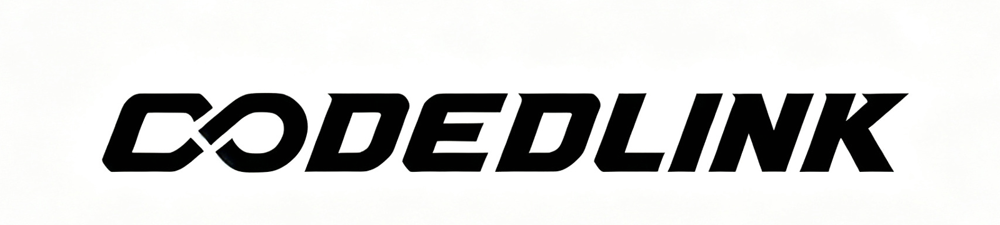

# Codex Dream Skin 完整使用教程

这是一份面向实际使用者的安装与操作说明。跟着对应平台的步骤完成安装、验证和恢复即可，不需要了解项目开发细节。

> Codex Dream Skin 是非官方外部主题工具，不隶属于 OpenAI。它不会修改官方 `.app`、`app.asar`、WindowsApps 或代码签名。

## 开始前必读

### 必须先安装 Codex

使用本项目之前，你的电脑必须已经安装 **官方 Codex Desktop**，并且至少正常启动过一次。

第一次启动 Codex 后，它会创建本项目需要的配置文件：

- macOS：`~/.codex/config.toml`
- Windows：`%USERPROFILE%\.codex\config.toml`

如果还没有安装 Codex，或者不知道如何完成首次配置，可以先查看 CODELINK 准备的安装教程：

<p align="center">
  <a href="https://api.codelink.chat/tutorial">
    
  </a>
</p>

<p align="center">
  <strong><a href="https://api.codelink.chat/tutorial">前往 CODELINK 教程中心</a></strong><br>
  登录后打开「Codex 接入」，可查看 Codex 客户端安装、Base URL、API Key 与模型配置说明。
</p>

> CODELINK 教程与本换肤项目相互独立。你可以只使用安装教程，不需要为了换肤修改 API Key 或 Base URL；Dream Skin 也不会自动改写你的模型供应商设置。

### 使用前还要确认

- Codex 当前可以正常打开。
- 重要任务已经保存，安装过程中可能需要重启 Codex。
- 主题图片是你有权使用的图片。
- 不要把 `.codex/auth.json`、API Key 或包含隐私的截图发给其他人。

## 选择你的平台

| 平台 | 推荐入口 | 是否支持一键换图 |
| --- | --- | :---: |
| Apple Silicon / Intel Mac | 双击 `macos/Install Codex Dream Skin.command` | 是 |
| Windows | 运行 `windows/scripts/install-dream-skin.ps1` | 否 |

- [macOS 安装与使用](#macos-安装与使用)
- [Windows 安装与使用](#windows-安装与使用)
- [验证主题是否真正可用](#验证主题是否真正可用)
- [恢复官方外观](#恢复官方外观)
- [常见问题](#常见问题)

---

## macOS 安装与使用

### 1. 前置条件

- 已安装并启动过一次官方 Codex Desktop。
- `~/.codex/config.toml` 已存在。
- 不需要另外安装 Node.js。安装器会校验并使用 Codex 自带的已签名 Node.js。

如果安装器提示找不到 Codex 配置，请先正常打开 Codex，等首页加载完成后退出，再重新安装。

### 2. 安装主题

打开下载并解压后的项目文件夹，进入 `macos`，双击：

```text
Install Codex Dream Skin.command
```

也可以使用终端安装：

```bash
cd Codex-Dream-Skin/macos
./scripts/install-dream-skin-macos.sh
```

安装器会自动完成：

1. 查找并校验官方 Codex。
2. 备份主题相关配置。
3. 安装 Dream Skin 引擎。
4. 创建桌面快捷入口。
5. 启动 Codex 并应用主题。

安装完成后，桌面会出现：

- `Codex Dream Skin.command`：启动或重新应用主题。
- `Codex Dream Skin - Customize.command`：更换图片和主题名称。
- `Codex Dream Skin - Verify.command`：检查主题并生成截图。
- `Codex Dream Skin - Restore.command`：完整恢复官方外观。

安装位置：

| 内容 | 路径 |
| --- | --- |
| Dream Skin 引擎 | `~/.codex/codex-dream-skin-studio` |
| 主题、状态和日志 | `~/Library/Application Support/CodexDreamSkinStudio` |
| Codex 配置 | `~/.codex/config.toml` |

如果 macOS 第一次阻止打开 `.command` 文件，请在 Finder 中右键该文件，选择“打开”并确认。不要关闭系统安全功能，也不要执行来历不明的解除隔离命令。

### 3. 换成自己的图片

双击桌面的：

```text
Codex Dream Skin - Customize.command
```

然后：

1. 在 Finder 中选择图片。
2. 输入这套主题的名称。
3. 等待 Codex 启动或重新应用主题。

建议图片：

- PNG、JPEG、HEIC、TIFF 或 WebP。
- 原图不超过 50 MB。
- 建议使用宽度 2000 像素以上的横图。
- 图片左侧尽量简洁，避免首页标题看不清。
- 不要使用包含假按钮、假输入框或完整软件界面的截图。

脚本会把图片转换为 JPEG，最长边限制为 3200 像素；转换后的文件不能超过 16 MB。

需要精确设置主题名称、文字和颜色时，可以使用：

```bash
~/.codex/codex-dream-skin-studio/scripts/customize-theme-macos.sh \
  --image "/图片的绝对路径/theme.png" \
  --name "我的 Codex 主题" \
  --tagline "把喜欢的画面变成工作台" \
  --quote "MAKE SOMETHING WONDERFUL" \
  --accent "#7cff46" \
  --secondary "#36d7e8" \
  --highlight "#642a8c"
```

恢复项目自带的演示主题：

```bash
~/.codex/codex-dream-skin-studio/scripts/customize-theme-macos.sh --reset-demo
```

### 4. 日常启动

以后需要使用主题时，双击：

```text
Codex Dream Skin.command
```

Mac 默认从本机端口 `9341` 开始寻找空闲端口，并保存实际使用的端口。如果 Codex 已经普通打开，启动器会询问是否重启。请先保存正在编辑的内容。

### 5. 可选：菜单栏入口

进入项目的 `macos` 文件夹，双击：

```text
Install Menu Bar.command
```

安装后可以从 SwiftBar 菜单快速应用、暂停、更换图片、切换已保存主题或完整恢复。

常见状态：

- `Skin ON`：主题正在运行。
- `Skin 暂停`：主题已临时关闭。
- `Skin ?`：状态不完整，需要重新启动或检查。
- `Skin 关`：主题没有运行。

菜单栏是可选功能，不安装也不影响桌面快捷入口。

---

## Windows 安装与使用

### 1. 前置条件

- 已从 Microsoft Store 安装并启动过一次官方 Codex。
- `%USERPROFILE%\.codex\config.toml` 已存在。
- 已安装 Node.js，PowerShell 中可以执行 `node`。

检查 Node.js：

```powershell
node --version
```

如果提示找不到命令，请安装当前 Node.js LTS，安装完成后重新打开 PowerShell。

### 2. 打开项目目录

在 PowerShell 中进入项目的 Windows 目录：

```powershell
cd "C:\你的路径\Codex-Dream-Skin\windows"
```

如果当前窗口禁止执行本地脚本，可以只为这一次 PowerShell 会话临时放行：

```powershell
Set-ExecutionPolicy -Scope Process Bypass
```

关闭 PowerShell 后，该设置会自动失效。不要为了本项目修改全系统执行策略。

### 3. 安装

```powershell
.\scripts\install-dream-skin.ps1
```

安装器会备份主题相关配置，并创建桌面和开始菜单快捷方式。Windows 状态和日志保存在：

```text
%LOCALAPPDATA%\CodexDreamSkin
```

### 4. 启动

建议先正常退出已经打开的 Codex，然后运行：

```powershell
.\scripts\start-dream-skin.ps1
```

Windows 默认使用本机端口 `9335`。

如果出现下面的提示：

```text
Codex is already running without dream-skin debugging on port 9335.
```

说明 Codex 已经以普通方式打开。保存工作并退出 Codex，然后重新运行启动脚本。

只有在确认可以重启当前 Codex 时，才使用：

```powershell
.\scripts\start-dream-skin.ps1 -RestartExisting
```

脚本会自动查找当前安装的最新 Codex Store 包。Codex 更新后，重新执行安装和启动即可，不要手动修改 WindowsApps。

### 5. Windows 当前限制

Windows 版本当前提供安装、启动、验证、截图和恢复功能，但没有 Mac 版的交互式一键换图入口。

主题资源位于 `windows\assets\`。直接修改这些文件属于开发者操作，修改后必须重新完成验证和恢复测试，不建议普通使用者直接编辑。

---

## 验证主题是否真正可用

看到背景图不代表安装已经完全成功。主题应用后，请检查真实的 Codex 控件仍然可以使用。

### macOS 自动验证

双击桌面的：

```text
Codex Dream Skin - Verify.command
```

验证器会检查当前页面并在桌面生成：

```text
Codex Dream Skin Verification.png
```

也可以运行：

```bash
~/.codex/codex-dream-skin-studio/scripts/verify-dream-skin-macos.sh \
  --reload \
  --screenshot "$HOME/Desktop/Codex Dream Skin Verification.png"
```

终端结果中的核心状态应为：

```json
"pass": true
```

### Windows 自动验证

```powershell
.\scripts\verify-dream-skin.ps1 -ScreenshotPath "$env:USERPROFILE\Desktop\Codex-Dream-Skin-Verification.png"
```

### 两个平台都要手动检查

1. 首页横幅正常显示，没有横向滚动条。
2. 首页能看到 2-4 个原生建议卡；数量可能随窗口宽度变化。
3. 点击一个建议卡，确认 Codex 的原生操作正常发生。
4. 点击真实项目选择器，确认项目菜单可以打开。
5. 在输入框输入几个字，确认光标和文字清晰可见，然后清空。
6. 打开一个已有任务，再返回 New Task，确认主题仍然存在。
7. 检查侧栏、菜单、弹窗、滚动条和输入框没有被图片遮挡。
8. 把窗口缩窄，再检查一次核心控件是否仍然可用。

如果验证脚本没有返回 `pass: true`，或者任何真实按钮被遮挡，都不能算安装成功。请先查看[常见问题](#常见问题)。

---

## 恢复官方外观

### macOS 暂停主题

暂停会移除当前皮肤并停止注入器，但不会重启 Codex，也不会恢复安装前的基础颜色：

```bash
~/.codex/codex-dream-skin-studio/scripts/pause-dream-skin-macos.sh
```

### macOS 完整恢复

双击桌面的：

```text
Codex Dream Skin - Restore.command
```

或者运行：

```bash
~/.codex/codex-dream-skin-studio/scripts/restore-dream-skin-macos.sh \
  --restore-base-theme \
  --restart-codex
```

需要同时删除本项目创建的桌面快捷入口：

```bash
~/.codex/codex-dream-skin-studio/scripts/restore-dream-skin-macos.sh \
  --restore-base-theme \
  --restart-codex \
  --uninstall
```

### Windows 完整恢复

只移除当前实时主题：

```powershell
.\scripts\restore-dream-skin.ps1
```

同时恢复安装前的基础主题配置：

```powershell
.\scripts\restore-dream-skin.ps1 -RestoreBaseTheme
```

恢复基础主题并删除项目创建的快捷方式：

```powershell
.\scripts\restore-dream-skin.ps1 -RestoreBaseTheme -Uninstall
```

恢复操作不会删除官方 Codex，也不会删除你的任务。

---

## 常见问题

### 提示找不到 `config.toml`

先正常启动一次官方 Codex，等待首页加载完成，然后退出 Codex 并重新运行安装器。不要复制其他人的配置文件。

### Codex 已经打开，主题无法启动

普通方式启动的 Codex 没有监听主题所需的 CDP 端口。保存工作、退出 Codex，再使用 Dream Skin 启动入口。

### Windows 找不到 `node`

安装当前 Node.js LTS，重新打开 PowerShell，然后确认 `node --version` 可以正常输出版本号。

### 端口被其他程序占用

Mac 会从 `9341` 开始自动寻找空闲端口。Windows 可以手动选择其他端口，但安装、启动、验证和恢复必须使用同一个端口，例如：

```powershell
.\scripts\install-dream-skin.ps1 -Port 9340
.\scripts\start-dream-skin.ps1 -Port 9340
.\scripts\verify-dream-skin.ps1 -Port 9340
.\scripts\restore-dream-skin.ps1 -Port 9340 -RestoreBaseTheme
```

不要把 CDP 地址改成 `0.0.0.0` 或局域网地址。

### Mac 图片无法转换

检查图片是否存在、是否超过 50 MB，以及格式是否能被 macOS 读取。优先使用普通 PNG 或 JPEG。如果转换后的文件仍超过 16 MB，也会被拒绝。

### 页面已经变色，但验证失败

可能是主题只注入了一部分，或者 Codex 更新后页面结构发生变化。请重点检查：

- 横幅、侧栏和输入框是否都能看到。
- 项目选择器是否仍然可以点击。
- 页面是否出现横向溢出。
- 状态目录中的注入器日志是否有错误。

不要删除验证条件来绕过失败。正确做法是更新兼容逻辑后重新验证。

### 刷新后主题消失

请使用 Dream Skin 的启动入口，不要只单独启动官方 Codex。主题依赖注入器在页面刷新和路由变化后重新应用。

### 恢复后仍然有主题颜色

确认执行了完整恢复，而不是只暂停或移除实时主题：

- macOS 使用 `--restore-base-theme --restart-codex`。
- Windows 使用 `-RestoreBaseTheme`，然后重新打开 Codex。

不要直接覆盖整个 `config.toml`，其中可能还有其他用户设置。

---

## 安全说明

- CDP 只绑定本机 `127.0.0.1`。主题运行期间，不要运行来源不明的本机程序。
- 本项目不修改官方安装目录和代码签名。
- 本项目不会自动修改 API Key 或 Base URL。
- 不要把完整效果截图当作整窗背景，图片中的假控件会误导使用者。
- 公开分享人物、角色或品牌主题前，请确认图片授权。
- 使用结束后可以随时执行完整恢复。

## 获取更多帮助

- Dream Skin 安装问题：先查看本页[常见问题](#常见问题)。
- Codex 下载、安装和接入问题：[CODELINK 教程中心](https://api.codelink.chat/tutorial)。
- 项目主页：[YYssong/Codex-Dream-Skin](https://github.com/YYssong/Codex-Dream-Skin)。
